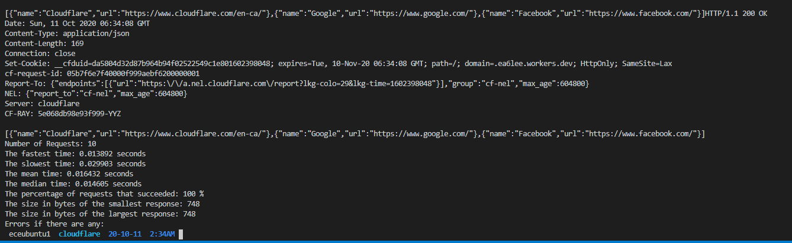
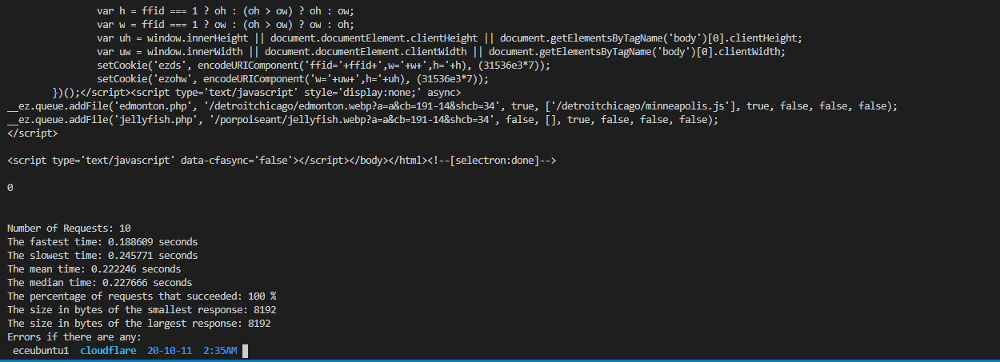
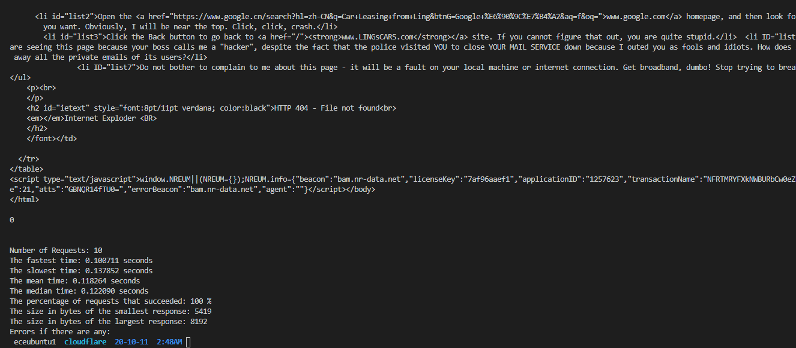

# Cloudflare Systems Engineering Assignment Ethan Lee

## Multi-threaded Using Pthreads
I implemented both a sequential and multi-threaded mode for this CLI tool. The issue was that some systems have a limit on the number of pthreads you can create. Thus, I provided the option to just run the tool sequentially to get requests.

## Requirements
1. You will need Make and gcc to compile
2. Unix environment
3. Requires the getopt_long library to get arguments GNU style (i.e. --url)

## How to Build:
- Run `make all` as seen in the Makefile
- Run `make clean` to remove the `/bin` directory
- By default we build to the `/bin` directory

## Usage:
Example of running using full url:
`./bin/cloudflare --url https://my-worker.ea6lee.workers.dev/links`

Example of running with profile:
`./bin/cloudflare --url https://my-worker.ea6lee.workers.dev/links --profile 10`

- `--url` : Needs to be a full url such as `https://my-worker.ea6lee.workers.dev/links`
- `--help` : Prints help page
- `--profile` : Specify number of requests. Default is 1
- `--sequential` : Optional argument to run workers sequentially instead of using multi-threading (pthreads)

## Results

Here is a picture of the results for `./bin/cloudflare --url https://my-worker.ea6lee.workers.dev/links --profile 10`

Here is a picture of the results for `./bin/cloudflare --url https://www.cultofmac.com/ --profile 10`

Here is a picture of the results for `./bin/cloudflare --url https://www.lingscars.com/ --profile 10`

As you can see Cloudflare Workers perform quite well compared to other sites as seen above. The average time for my worker was 0.016 seconds, but for the other two sites, they had average times of 0.228 seconds and 0.122 seconds.
